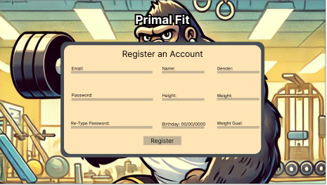

# Design Specification

## Requirement 1: The user shall be able to schedule routines for each day with workout options to choose from and be displayed with an instructional video

1. ***Workout Page*** The workout page shall have the following structure: 
    - a video showing an example of the exercise, timer/stopwatch for tracking the duration of a workout
    - start/stop for the timer/stopwatch
    - a back/next button for going back and forth the next workout.
     

2. ***Routine Page*** We shall make a CRUD for the routines objects.
    - The user will be bale to create, update and delete the routines using these buttons on the UI. 
    
    
    
3. ***Routine Layout***
    - A routine object shall contain a days of the week
    - A routine shall be composed of exercise objects in an ordered list
    

## Requirement 2: The user shall be required to create an account when accessing the website for the first time.

1. ***Registration Page*** 
    - This page shall require the user to input information about themselves for later calculations
    - This data will then be directed to a flask api route to create a user onto the DB

    

## Requirement 3: The user shall be able to login to the website and have there data saved for later use.
2. ***Login Page***
    - A user shall be prompted to login to the website if they want to access their fitness history
    
    - Once a user has been created a comparison will be made in a flask api to determine if the user exist when logging in 
    

## Requirement 4: A user shall be able to search common foods and input them into their meals for the day

1. ***Food Search Page*** 
    - This page shall have a text field that allows users to search for foods, it will then generate responses that match the search. 
    - These results shall show calories, protein, fats and carbohydrate information.
    - The user will then be able to add a selected food to one of their daily meals
    
2. **Food Search Flow Chart**
    - The search page will utilizie a search flask api route to search a food database
    - Then this data will be returned to the front end to be displayed to the user
    
