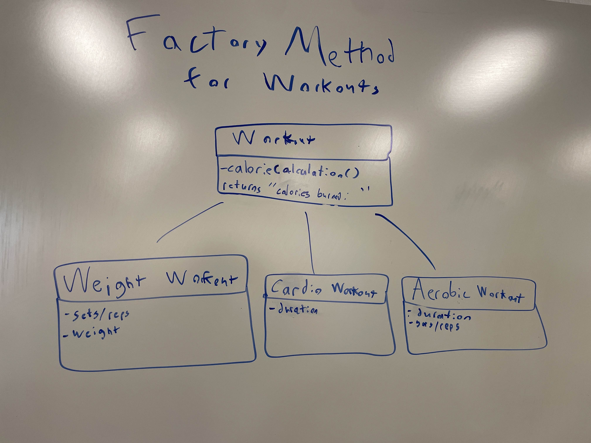

# Meeting Minutes (10/22/2024 (Tuesday))

## Administrivia
The scribe is the person taking the _notes_. This is encouraged to be a single person to reduce problems.
* Time: 11:45-1:30
* Location: Russ 
* Scribe: Aziz

## Agenda
* Work On MVD
* Finishing the MVS
* Created Environment to Code

## Notes

## Action Items

## Signatures
After the notes and action items have been pushed, each person should take a time to review them. If everything is agreeable, push a single commit with your name as a signature. 
* Aziz
* ...

# Meeting Minutes (10/24/2024 (Thursday))

## Administrivia
The scribe is the person taking the _notes_. This is encouraged to be a single person to reduce problems.
* Time: 12:30-1:30
* Location: Russ
* Scribe: Aziz

## Agenda
* Upload all pictures/ png files to github
  * David will upload all screenshots of figma to github:
  * Aziz will upload the flowcharts completed 
* Get the Environment set up on everyones devices
  * Dilean will set up the environment on everyones devices 
* Branch prunning 
  * Jinho will clean up all branches in github 
* Database design 
  * Jinho will work on data base design after prunning branches

## Notes
* Cogan: "Get your guys's shit together!!"

## Action Items
These are generally distilled from the notes. Essentially, these are "by the next meetings, _this person_ will take _this action_."
* Everyone
  * MVD will be finished by next meeting
* Jinho
  * Logical database model will be finished by next two meetings

## Signatures
After the notes and action items have been pushed, each person should take a time to review them. If everything is agreeable, push a single commit with your name as a signature. 
* Aziz 
* ...