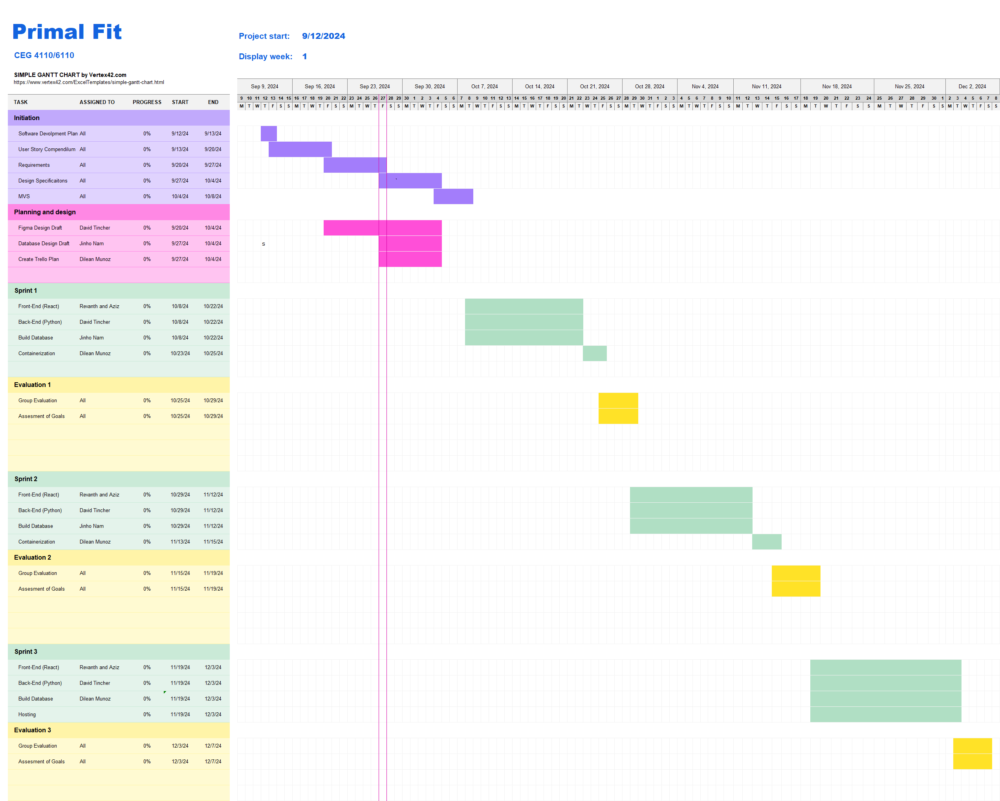

# Software Development Plan

## SDLC (Software Development Life Cycle) Details

Every Tuesday we will be discussing the plans for the week and completing certain deliverables. Thursdays we will be used for reviewing progress and group troubleshooting. 

We will be using the Agile methodology with sprints spanning two weeks. We are going to be using Trello to organize our task and manage our sprint cycles.  

## Project Management

A team member will be appointed a specific requirment and will delegate responsibilities to other team members. We will be using Trello to manage our project for our team. This will be used so all memebers of the team have a clear understanding of what and when things are due. During every team meeting we will go over the Trello to analyze the progress of team members and to see where to go forward from there.

 - Leader: Dilean
    - Dilean has experience as a full stack developer giving him better a idea of the scopes of the milestones. 
 - Front End: Revanth, Aziz
    - Revanth has experience with JS, CSS and HTML from his undergraduate assignments, Aziz has experience with Java Swing and creating user interfaces. 
 - Back End: Jinho, David
    - Jinho has knowledge on database design from previous course, and David has experience writng python creating discord bots.  

## Communication Plan

- Meeting Location(s)
    - Fawcett Hall
    - Russ Engineering Building
    - Discord

- Meeting Time(s)
    - Tuesday and Thursday 12:30 PM - 1:30 PM
    - Exceptions being holidays 

- Meeting Cadence
    - Twice per week

- Communication mechanism(s) for outside of meetings
    - Discord

We anticipate communicating via discord outside of meetings. We have committed to responding within a couple of hours. We will be meeting at these locations because they are convenient places for us all to gather. We will be meeting at the times given for our convenience because it is directly after lecture. We decided to meet twice per week to stay on schedule with the Gantt chart and to keep everyone motivated.

## Timeline
### Gantt Chart

1. Requirements - due 27th September
2. Design Specification - due 4th October
3. Milestones (i.e., "check-in") - Every 2 weeks(first check-in being October 1st)
4. MVS (Minimal viable Specification) - due 8th October 
